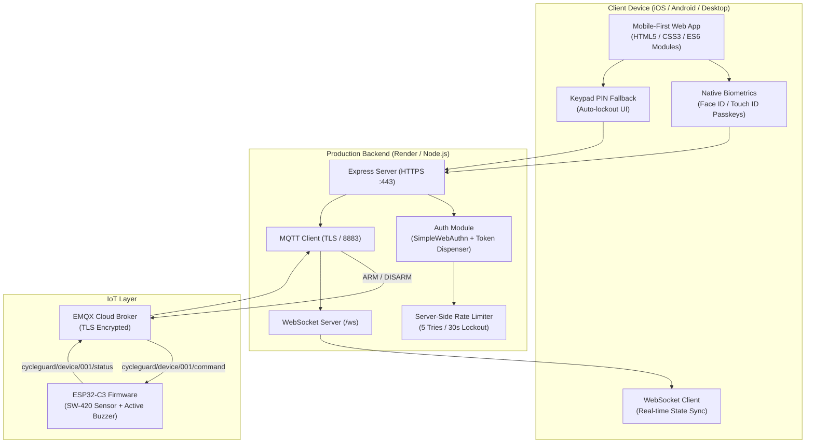

# CycleGuard — Project Completion Summary

> **Status**: Ready for Production & Physical Deployment  
> **Live Production URL**: [https://cycleguard-3jlr.onrender.com/](https://cycleguard-3jlr.onrender.com/)  
> **GitHub Repository**: [https://github.com/Manoj1832/CycleGuard.git](https://github.com/Manoj1832/CycleGuard.git)  
> **Last Verified**: September 2026

---

## 1. System Architecture Overview



---

## 2. Completed Features & Implementation Details

### A. Biometric Authentication & Passkeys (WebAuthn)
* **Native WebAuthn Client (`frontend/js/webauthn.js`)**:
  - Implemented using native browser `navigator.credentials` APIs.
  - Zero heavy external frontend libraries; full binary ArrayBuffer/Base64URL serialization.
* **iOS / Safari Passkey Registration Flow**:
  - Automatic on-boarding: When an Apple device without an existing passkey attempts to Arm/Disarm, the browser prompts native Face ID / Touch ID passkey registration and executes the action smoothly.
* **Dynamic `rpID` and Origin Resolution**:
  - Relying Party ID automatically matches the host header (`req.hostname`), ensuring WebAuthn works across `localhost`, private LAN IPs, Cloudflare Tunnels, and Render domains (`cycleguard-3jlr.onrender.com`).
* **Cryptographic Single-Use Authorization Tokens (`authToken`)**:
  - Verification issues a temporary 60-second in-memory token.
  - Commands (`/arm`, `/disarm`, `/alarm/clear`) require and consume this single-use token.

### B. PIN Fallback & Server-Enforced Lockout
* **4-Digit Tactile Keypad**:
  - Quick toggle between Biometrics and 4-digit PIN fallback.
  - Numeric on-screen touch keypad and physical keyboard support with tactile click animations and dot indicators.
* **Server-Side Rate Limiter & Lockout**:
  - Maximum **5 consecutive failed attempts**.
  - **30-second server-side lockout**: Rate limit state is enforced in the backend. Page reloads, cache clears, or device restarts cannot bypass lockout.
  - Real-time countdown timer rendered directly on screen until lock expires.

### C. Frontend UI & UX
* **Mobile-First Unified Bottom Sheet (`frontend/js/auth.js`, `frontend/index.html`)**:
  - Dynamic state machine handling 7 flow states:
    - `BIOMETRIC_PENDING`
    - `BIOMETRIC_FAILED`
    - `BIOMETRIC_UNAVAILABLE`
    - `PIN_REQUIRED`
    - `PIN_VERIFYING`
    - `PIN_FAILED`
    - `LOCKED_OUT`
  - Dark glassmorphic design system with CSS tokens, pulsing biometric icons, and slide animations.
* **Single-Tap Protection**:
  - Action button enters a loading state (`isActionPending`) when clicked, disabling double-taps and preventing duplicate command dispatches.
* **True Connection State Tracking**:
  - Resolved false "Reconnecting..." banners so alerts only show during genuine network disconnects.
* **Developer Diagnostics Panel**:
  - Hidden debug view opened via `Ctrl + Shift + D` or footer taps to monitor active WebAuthn challenges, passkey registrations, and mock hardware telemetry.

### D. IoT & MQTT Integration
* **Strict Protocol Preservation**:
  - ESP32 hardware never receives biometrics, PINs, or cryptographic tokens.
  - Commands sent over MQTT broker are strictly single-word contracts: `ARM` and `DISARM`.
* **EMQX Cloud Broker over TLS (Port 8883)**:
  - Secure TLS connection with auto-reconnection and keep-alive handling.
  - Topics:
    - `cycleguard/device/001/command` (Payload: `ARM` / `DISARM`)
    - `cycleguard/device/001/status` (Telemetry: state, battery, sensor status)
    - `cycleguard/device/001/alert` (Vibration alerts)

---

## 3. Production Deployment & Live Status

| Component | Target / Environment | Live Status | Details |
| :--- | :--- | :---: | :--- |
| **Git Repository** | `https://github.com/Manoj1832/CycleGuard.git` | 🟢 Up-to-Date | Clean working tree pushed to `main` branch |
| **Render Cloud Host** | `https://cycleguard-3jlr.onrender.com/` | 🟢 Live | Web services and static frontend combined |
| **Health Check** | `/api/health` | 🟢 Healthy | MQTT connected: `true`, WebSocket clients connected |
| **Passkey Store** | SimpleWebAuthn on Render | 🟢 Active | Live credential registered (`transports: ["internal", "hybrid"]`) |
| **Device State** | `/api/device/001/status` | 🟢 Armed | Security state verified: `ON` |
| **Lockout Status** | `/api/auth/status` | 🟢 Monitored | 5 attempts allowed, active rate limiter |

---

## 4. Repository Structure & Key Files

```
CycleGuard/
├── backend/
│   ├── src/
│   │   ├── auth.js            # WebAuthn verification, rate limiting, token dispenser
│   │   ├── config.js          # Environment variables & frozen configurations
│   │   ├── mqtt.js            # EMQX TLS client & topic subscriptions
│   │   ├── server.js          # Express app, Helmet CSP, WebSocket server
│   │   └── routes/
│   │       ├── auth.js        # WebAuthn options/verify & PIN endpoints
│   │       ├── device.js      # Device status & telemetry query routes
│   │       └── security.js    # Protected ARM/DISARM/ALARM_CLEAR routes
│   ├── .env.example           # Reference environment variables
│   └── package.json           # Node.js dependencies (@simplewebauthn/server, mqtt, ws)
├── frontend/
│   ├── css/
│   │   ├── animations.css     # Keypad shake, pulsing biometrics, slide sheets
│   │   ├── components.css     # Glassmorphic cards, keypad buttons, status badges
│   │   ├── main.css           # Layout, CSS custom properties, responsive grid
│   │   └── reset.css          # CSS reset & box-sizing
│   ├── js/
│   │   ├── api.js             # Fetch wrapper for backend endpoints
│   │   ├── app.js             # Main application orchestrator
│   │   ├── auth.js            # Master authentication state machine & UI sheet
│   │   ├── config.js          # Auto-detecting host, origin, and protocols
│   │   ├── state.js           # Observable reactive client state store
│   │   ├── ui.js              # DOM rendering, button handlers, status updates
│   │   ├── webauthn.js        # Pure browser WebAuthn API client
│   │   └── websocket.js       # Real-time WebSocket manager with backoff
│   └── index.html             # Mobile-first PWA dashboard & multi-view modals
├── firmware/
│   ├── src/
│   │   ├── main.cpp           # ESP32-C3 firmware logic
│   │   └── config.h           # WiFi and MQTT broker credentials
│   └── README.md              # Wiring schematics, GPIO pinout, and flashing guide
└── PROJECT_COMPLETION_SUMMARY.md # This document
```

---

## 5. Physical Hardware Setup (ESP32-C3)

When ready to connect the physical hardware to your bicycle:

1. **Wiring**:
   * **SW-420 Vibration Sensor**: Signal -> `GPIO 4`, VCC -> `3.3V`, GND -> `GND`
   * **Active Piezo Buzzer**: Positive -> `GPIO 5`, Negative -> `GND`
   * **Status LED**: Anode -> `GPIO 2`, Cathode -> `GND` via 330Ω resistor
2. **Configuration**:
   * Open `firmware/src/config.h` and configure local WiFi SSID and password.
3. **Flashing**:
   * Connect ESP32-C3 via USB and upload using PlatformIO or Arduino IDE.
4. **Operation**:
   * ESP32 will connect to EMQX Cloud over TLS. Any command sent from your phone via [https://cycleguard-3jlr.onrender.com/](https://cycleguard-3jlr.onrender.com/) will instantly arm or disarm the bike.

---

## 6. Security & Reliability Hardening Matrix (Audit Fixes)

| Finding | Severity | Description | Fix Implemented |
|---|---|---|---|
| **F1** | Critical | ARM claimed success when MQTT link was down | `/arm`, `/disarm`, and `/alarm/clear` check `isMqttConnected()` and `publishCommand()` returning 503 if broker is down. Transitions to a pending state awaiting confirmation from ESP32. |
| **F2** | Critical | Mock biometric endpoint `/api/auth/mock/verify` bypass | Gated with `!config.auth.mockMode || config.nodeEnv === 'production'` to return 404 in production. |
| **F3** | Critical | Passkey registration open to anyone; RAM wipes | Required PIN-verified `authToken` or `SETUP_TOKEN` for registration; persisted credentials to disk (`data/credentials.json`). |
| **F4** | High | Plaintext PIN in repository and timing vulnerability | Removed hardcoded PIN from `frontend/js/config.js`; implemented constant-time comparison `crypto.timingSafeEqual` with `scrypt` hash (`PIN_HASH`). |
| **F5** | High | Shared lockout across users behind Render proxy | Added `app.set('trust proxy', 1)` so Express reads real client IP from reverse proxy headers. |
| **F6** | High | State lost on Render service sleep/restart | Implemented disk persistence for device states (`data/state.json`) and passkeys (`data/credentials.json`). |
| **F7** | Medium | MQTT contract discrepancies | Synchronized JSON command contract `{"command":"ARM","timestamp":"..."}`; handled `alarmActive` boolean from device status message. |
| **F8** | Medium | CORS reflection, WebSocket origin leaks & alert replay | Restricted CORS in production; validated WebSocket origin; deduplicated movement alerts by timestamp; stripped Dev Panel from production DOM. |

